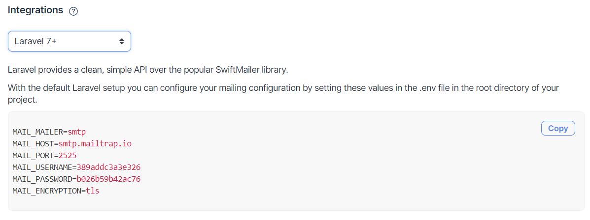
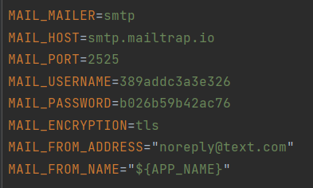

# Implementation Technology

Our software is a web app built with the Laravel framework. In order to deploy the project from his/her own computer one would have to follow these steps:

## Prerequisites
1. XAMPP web server solution stack 8+ (https://www.apachefriends.org/index.html)
   - PHP 8.0.x which comes with XAMPP
   - MariaDB fork of the MySQL relational database management system comes with XAMPP
   - (optional) Apache web server also comes with XAMPP
2. Composer package manager for PHP (version 2.0.8) (https://getcomposer.org/download/)
3. (optional) npm package manager (version 7.0.8) which comes with Node.js (15.1.0) (https://nodejs.org/en/download/)
4. Git installed in your system (2.31.1)

## Steps to implement in your own computer
1. Clone the repository with `git clone https://github.com/kdomi18/kot.git`
2. Go to the folder application using cd command on your cmd or terminal
3. Run composer install on your cmd or terminal
4. Copy .env.example file to .env on the root folder. You can type `copy .env.example .env` if using command prompt Windows or `cp .env.example .env` if using terminal, Ubuntu
5. Open your .env file and change the database name (DB_DATABASE) to whatever you have, username (DB_USERNAME) and password (DB_PASSWORD) field correspond to your configuration.
   By default, the username is root, and you can leave the password field empty. (This is for Xampp)
   By default, the username is root and password is also root. (This is for Lamp)
6. Start XAMPP Control Panel
7. Start MySQL sevice and Apache service with XAMPP control panel
8. Run `php artisan key:generate`
9. Run `php artisan migrate --seed`
10. If you want to register a new account or be able to access User Management view you need to follow the following steps, else you may skip them.
    - Create a new account with https://mailtrap.io/
    - Choose Laravel 7+ integration like below  
    - Copy the 6 lines provided there and change the configuration in .env file like so:  
    - Run `php artisan serve`
    - Go to http://127.0.0.1:8000
    - Go to register page through top right button
    - Follow the steps to register
    - Click the reset password link sent in your newly created mailtrap.io account
    - Choose a password for yourself and log in
    
11. If you prefer not to register then log in with credentials email : admin@admin.com,  password : password (NOTE: you’ll need to set up mailtrap.io like I explained above in order to access User Management view)

